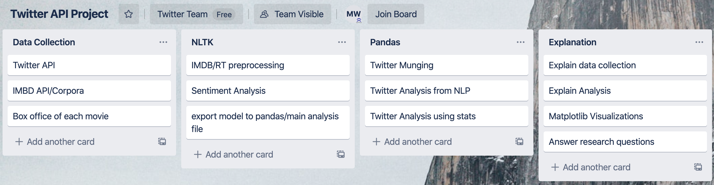

# Twitter vs. Marvel 

## Group Members: Eitan Lupovitch, Rob Creel, Shasta Bell, Maxwell Wibert

### Date: 12/21/2019

## Description:
We are pulling reviews data from the IMDB API (both ratings and associated text reviews) of five different films in the Marvel universe (Avengers, Age of Ultron, Civil War, Infinity Wars, and End Game). Using this data, we are building word associations for positive and negative reactions to these films, which we will plot using Matplotlib. Then, using the Twitter API, we will compare IMDBs' and Rotten Tomatoes' reviews to the Twitter universes' reactions to these films by cross referencing key words and time stamp datas. We will then visualize this comparison to validate IMDB scores and answer various questions about society's feelings about the Marvel universe. 

## Research Questions to Answer:
1. Which is the most popular Avengers movie on IMDB and twitter?
2. Which is the least popular Avengers movie on IMDB and twitter?
3. How did peoples' feelings towards MCU change over time? 
4. Does the money/box office align with twitter reactions?

## Datasets to Be Used:
1. IMDB ratings of MCU movies.
2. NLTK filtered twitter responses. 
3. Box office revenues of movies. 

## Rough Breakdown of Tasks:

