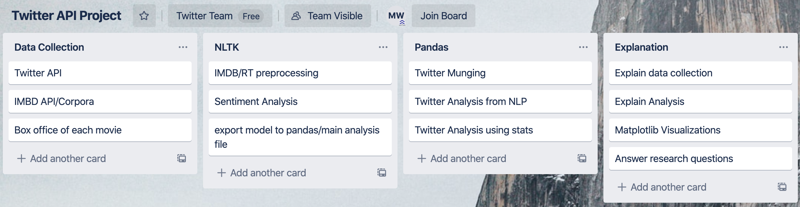

# Avengers Sentiment Analysis
## Group Members: Eitan Lupovitch, Rob Creel, Shasta Bell, Maxwell Wibert
### Date: 12/21/2019
## Description:
We are pulling reviews data from the MovieDB API (both ratings and associated text reviews) of five different films in the Marvel universe (Avengers, Age of Ultron, Civil War, Infinity Wars, and End Game). Using this data, we are building word associations for positive and negative reactions to these films, which we will plot using Matplotlib. We will then visualize this comparison to validate IMDB scores and answer various questions about society's feelings about the Marvel universe.
## Research Questions to Answer:
1. Which film is rated highest according to score, normal score, and user rating?
2. Which film is rated lowest according to score, normal score, and user rating?
3. Do these ratings make sense and do they correlate with each other and box office revenue?
4. Domestic vs. gross revenue compared to ratings?
5. How does runtime affect people's reviews?
6. What are the limitations of these metrics?
7. How has sentiment changed over time?
8. Reflection
## Datasets to Be Used:
1. MovieDB ratings.
2. NLTK filtered MovieDB responses.
3. Box office revenues of movies.
## Rough Breakdown of Tasks:

